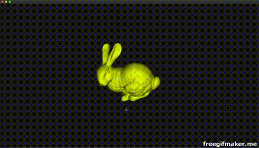
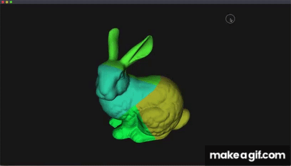
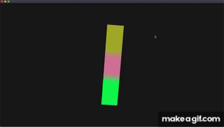

# Physics based mesh deformation (Meshless Deformations Based on Shape Matching)

trying to implement (https://www.cs.drexel.edu/~david/Classes/Papers/MeshlessDeformations_SIG05.pdf)

TODO : Set User Interaction as applying force, current : setting position (DONE)
TODO : mesh rendering (DONE)

12.22.2018 : Implemented clustering

